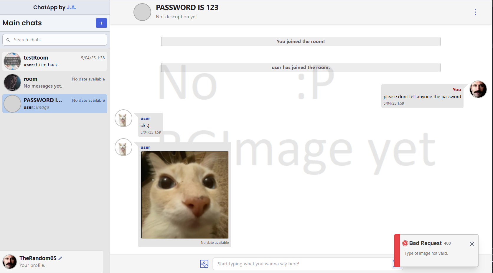
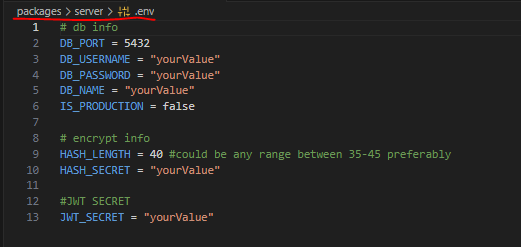

> [!IMPORTANT]
> Im still updating this.

# 🗣 Chat Application

_Relying primarily on WebSockets, JWT for auth and Postgresql as my DB._

**There's nothing to add since it's just a Real Time Chat on your browser, you can upload photos, talk and create/join rooms.**


_(The UI error was forced only for demostration)_

- 👎 **Downsides**:

  - Loads all images immediately after login making the **Interaction to Next Paint (INP)** be huge
  - There's some UI bugs with **Firefox engine (Gecko)**
  - Project structure is just a mess and it gets worse and worse
  - If there's a ton of messages in a room, it will take a notable time to load in
  - **And probably a lot of minor bugs that require time to fix**.

- ⌛ **Pending Fixes/Features**:
  - [See all users in the room](https://github.com/shadcn-ui/ui/issues/1011#issuecomment-1930103090)
  - Optimize server logic and prevent more react updates
  - Finish roles & grant permissions (Admin, User & Moderator)
  - Cache react renders...? (useMemo or simply activate the compiler)

#### What went wrong:

I learnt a ton with this project, but at this point it's just tiring & frustrating to continue because of my:

- **horrible project structure** (im trying to improve that)
- **bad decision making** (caused by not knowing what i wanted)
- **the feeling of getting stuck** (i can't continue other projects cuz of this)
- and **lack of knowledge** which thats the main reason i made this in the first place.

## ℹ **Install guide:**

> [!CAUTION]
> I don't recommend this project for learning or use it in real life scenarios since it wasn't tested properly and could have potential security risks.



1. Create a .env file in $packages/server$ and put these variables names:

   - 🚨**DONT SHARE THESE VALUES**🚨
   - **DB_PORT =** (_4 digit number_ -> to host your server, default is 5432)
   - **DB_USERNAME =** (_string_ -> Your postgresql username )
   - **DB_PASSWORD =** (_string_ -> Your postgresql user password )
   - **DB_NAME =** (_string_ -> Your postgresql database name, where the sql was executed in)
   - **HASH_LENGTH =** (_number_ -> Recommended **40**. It's the size its going to be the hashed passwords)
   - **HASH_SECRET =** (_string_ -> 🚨NEEDS TO BE HARD TO DECIPHER🚨)
   - **JWT_SECRET =** (_string_ -> 🚨NEEDS TO BE HARD TO DECIPHER🚨)

2. Clone the repository & install packages:

```bash
git clone https://github.com/Aragon-Joaquin/Chat-Application.git
cd Chat-Application
npm i
```

(if **npm i** does not work, manually install the packages by:)

```bash
  cd packages/client
  npm i
  cd ../server
  npm i
```

3. Go to the main root and run the project with:

```bash
npm run dev (starts both client & server)
```

4. And i think that should be it. Remember to execute the sql in the $/wireframes$ folder and created the DB.

## 📚 **What i've used:**

- General

  - TypeScript

- Server

  - NestJS
  - TypeORM
  - Socket.io (@nestjs/websockets & @nestjs/platform-socket.io)
  - Postgresql

- Client
  - NextJS
  - Radix UI
  - Tailwind CSS

## Commits information

- 🔰 **Initial commit** = :beginner:
- **Updates:**
  - 🚀 Big update = :rocket:
  - 💥 Medium update = :boom:
  - ⭐ Small update = :star:
  - 🔨 Bug fix = :hammer:
- **Extras:**
  - 💻 Added new technology = :computer:
  - 🌈 UI Update = :rainbow:
